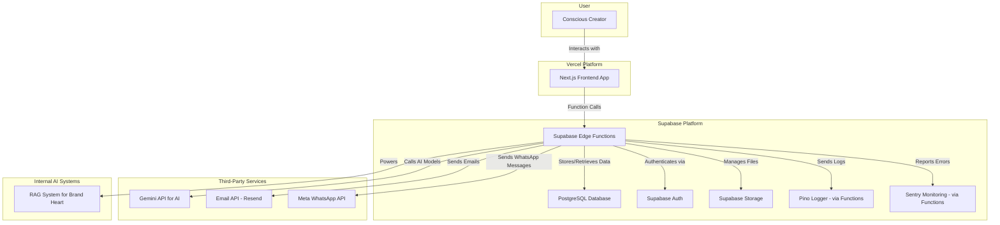

# Alma App Fullstack Architecture Document

## Introduction
This document outlines the complete fullstack architecture for the Alma App, including backend systems, frontend implementation, and their integration. It serves as the single source of truth for AI-driven development, ensuring consistency across the entire technology stack, guided by the principles of Regenerative Marketing and Emotional Design.

**Change Log**

| Date | Version | Description | Author |
| :--- | :--- | :--- | :--- |
| 2025-08-10 | 1.0 | Initial Architecture Draft | Winston (Architect) |

## High Level Architecture

### Technical Summary
The Alma App will be a modern, full-stack TypeScript application. The frontend will be a server-side rendered (SSR) Next.js application, ensuring a fast and SEO-friendly user experience. The backend logic will be handled by Supabase Edge Functions. The entire backend infrastructure, including the database, authentication, and file storage, will be managed by Supabase, with the database schema managed via Supabase's built-in migration tools. A Retrieval-Augmented Generation (RAG) system will be implemented to provide context-aware assistance for filling out the Brand Heart.

### Platform and Infrastructure Choice
*   **Platform:** Vercel for the Next.js frontend and Supabase for the entire backend infrastructure.
*   **Key Services:**
    *   **Vercel:** Frontend hosting and deployment.
    *   **Supabase:** PostgreSQL Database, Authentication, Storage, and Edge Functions for backend logic.
*   **Deployment Host and Regions:** US-East to start, with the ability to expand.

### Repository Structure
*   **Structure:** A standard Next.js application structure. The Supabase-related code, including Edge Functions, will be located in a `supabase` directory at the project root.

### High Level Architecture Diagram


## Tech Stack

| Category | Technology | Version | Purpose |
| :--- | :--- | :--- | :--- |
| Frontend Language | TypeScript | ~5.x | Type safety and scalability. |
| Frontend Framework | Next.js | ~14.x | SSR, routing, and React framework. |
| UI Component Library | Tailwind CSS | ~5.x | Foundational accessible components. |
| State Management | Zustand | ~4.x | Simple, lightweight state management. |
| Backend | Supabase Edge Functions | Deno | Serverless backend logic. |
| Database | PostgreSQL | Supabase-managed | Relational data storage. |
| File Storage | Supabase Storage | | For user document uploads. |
| Authentication | Supabase Auth | | Secure user management. |
| Frontend Testing | Jest & RTL | Latest | Unit and component testing. |
| Backend Testing | Deno Testing | Latest | Unit and integration testing for functions. |
| E2E Testing | Cypress | Latest | End-to-end user flow testing. |
| CI/CD | GitHub Actions | | Automated builds and deployments. |
| Monitoring | Sentry | | Error tracking and performance. |
| Logging | Pino | | Structured and efficient logging. |

## Data Models

### User
*   **Purpose:** Represents an authenticated user of the platform.
*   **Key Attributes:** `id`, `email`, `created_at`, `primary_language`, `secondary_language`.
*   **Relationships:** Has one Brand Heart, has many Offerings.

### BrandHeart
*   **Purpose:** Stores the core essence of the user's brand.
*   **Key Attributes:** `id`, `user_id`, `mission`, `vision`, `values`, `tone_of_voice`, `created_at`, `updated_at`.
*   **Relationships:** Belongs to a User.

### BrandDocument
*   **Purpose:** Stores the content and vector embeddings of user-uploaded documents for RAG.
*   **Key Attributes:** `id`, `user_id`, `file_name`, `content`, `embedding`, `created_at`.
*   **Relationships:** Belongs to a User.

### Offering
*   **Purpose:** Represents a product, service, or event the user wants to market.
*   **Key Attributes:** `id`, `user_id`, `title`, `description`, `type`, `contextual_notes` (with fields for both languages).
*   **Relationships:** Belongs to a User, can have many Funnels and Content pieces.

### Content
*   **Purpose:** A piece of marketing content generated by the AI.
*   **Key Attributes:** `id`, `offering_id`, `content_body` (bilingual), `status` (Draft, Approved, Scheduled), `scheduled_at`.
*   **Relationships:** Belongs to an Offering.

### Testimonial
*   **Purpose:** Stores customer testimonials.
*   **Key Attributes:** `id`, `offering_id`, `customer_name`, `testimonial_text`.
*   **Relationships:** Belongs to an Offering.

## Unified Project Structure

```
alma-app/
├── src/
│   ├── app/            # Next.js App Router
│   ├── components/     # Shared React components
│   ├── lib/            # Shared libraries, helpers
│   └── types/          # Shared TypeScript interfaces
├── supabase/
│   └── functions/      # Supabase Edge Functions
├── .github/
│   └── workflows/      # GitHub Actions CI/CD
└── package.json        # Project dependencies
```

## Security and Performance

### Security
*   **Authentication:** Handled by Supabase Auth (JWT-based).
*   **Authorization:** Implemented in Supabase Edge Functions and via PostgreSQL Row Level Security (RLS).
*   **Data:** All sensitive data is encrypted at rest and in transit by Supabase.
*   **File Uploads:** Supabase Storage will be configured with strict policies to only allow authenticated users to upload specific file types.

### Performance
*   **Frontend:** Next.js SSR and Vercel's edge network will ensure fast initial page loads. Images will be optimized using Next/Image.
*   **Backend:** Supabase Edge Functions are globally distributed for low latency. Database queries will be optimized.
*   **API:** Edge Functions can be called directly, reducing payload size and complexity.
