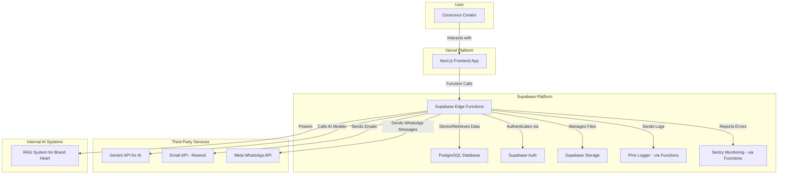

# High Level Architecture

## Technical Summary
The Alma App will be a modern, full-stack TypeScript application. The frontend will be a server-side rendered (SSR) Next.js application, ensuring a fast and SEO-friendly user experience. The backend logic will be handled by Supabase Edge Functions. The entire backend infrastructure, including the database, authentication, and file storage, will be managed by Supabase, with the database schema managed via Supabase's built-in migration tools. A Retrieval-Augmented Generation (RAG) system will be implemented to provide context-aware assistance for filling out the Brand Heart.

## Platform and Infrastructure Choice
*   **Platform:** Vercel for the Next.js frontend and Supabase for the entire backend infrastructure.
*   **Key Services:**
    *   **Vercel:** Frontend hosting and deployment.
    *   **Supabase:** PostgreSQL Database, Authentication, Storage, and Edge Functions for backend logic.
*   **Deployment Host and Regions:** US-East to start, with the ability to expand.

## Repository Structure
*   **Structure:** A standard Next.js application structure. The Supabase-related code, including Edge Functions, will be located in a `supabase` directory at the project root.

## High Level Architecture Diagram

